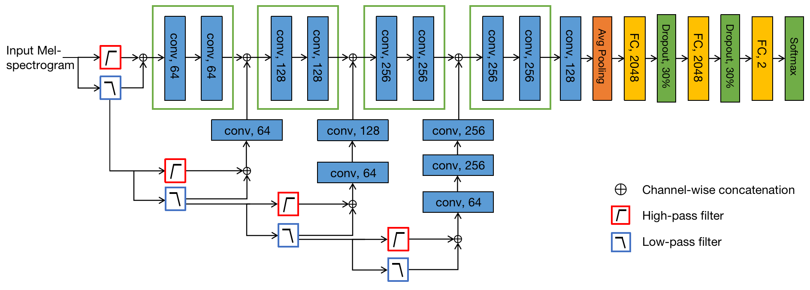

# ARWaveletCNN
Adversarialy Robust WaveletCNN Code for our paper.

The architecture of our ARWaveletCNN model is as follows:

This repository contains the code for our proposed ARWaveletCNN model, as well as DenseNet121 best performing model, and their respective evaluations. Files also contain code to reproduce all of our experiments in the paper.
For the sake of analysis and to fully understand how the ARWaveletCNN model works, we include the following visualizations:
  - A [visualization of the Harmonic and Percussive parts](https://github.com/fathana/ARWaveletCNN/blob/main/Visualize%20generated%20augmentations%20and%20plot%20harmonic%20and%20percussive%20parts.ipynb) of several different audio files (including augmented audio samples using spoof augmentations from https://github.com/fathana/spoofAugment).
  - A [visualization of several wavelet transforms](https://github.com/fathana/ARWaveletCNN/blob/main/Visualize_wavelet_transforms_of_original_audios_and_their_augmentations.ipynb) (e.g. Haar, db2, dmey, etc.) comprising the different channels.
  - A comprehensive and detailed [visualization of the generated feature-maps/activations of ARWaveletCNN](https://github.com/fathana/ARWaveletCNN/blob/main/waveletCNN_visualize_feature_maps.ipynb) from input to output (including all successive layers) using several different input files (bonafide, spoof, augmented, correctly classified, and misclassified samples) which clearly shows that the ARWaveletCNN architecture works by eliminating all seemingly normal features throughout the successive layers (less relevant for further decisions), and keeping all appearently anomalous/distorted artefacts (= indicators of a flawed fake audio) in the original input. In this case, a final blank output feature-map (absence of anomalies in the last layer) indicates that the audio sample is bonafide (perfect symmetry between the successive wavelet transforms and the convolutional filters), otherwise a presence of residues of anomalies/impurities in the final convolutional layer's feature-map indicates that the input has been altered (spoofed).
